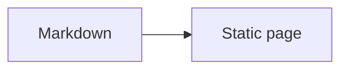

# Blog

基于 Nuxt 4、Nuxt Content 和 GitHub Pages 的个人博客。

线上地址：<https://blog.enderliquid.top>

站点提供中英文界面、Pagefind 搜索、RSS、Sitemap、Giscus 评论，以及构建期渲染的数学公式和 Mermaid/TikZ 图表。

## 快速开始

要求 Node.js 24.11 或更高版本。

```bash
npm install
npm run dev
```

`npm run dev` 会启动开发服务器，并在文章、语言配置和站点构建来源变化时刷新资源清单。

### 常用命令

| 命令                                      | 用途                                         |
| ----------------------------------------- | -------------------------------------------- |
| `npm run dev`                             | 启动本地开发服务器。                         |
| `npm run diagrams:prepare`                | 单独准备并校验 Mermaid/TikZ 静态图表资产。   |
| `npm run site:manifest`                   | 准备图表资产，生成并校验站点资源清单。       |
| `npm run content:check`                   | 兼容的内容校验入口，作用与资源清单生成相同。 |
| `npm run test:unit`                       | 运行单元测试。                               |
| `npm run typecheck`                       | 生成资源清单后执行类型检查。                 |
| `npm run format` / `npm run format:check` | 格式化代码 / 检查格式。                      |
| `npm run generate`                        | 生成静态站点和 Pagefind 索引。               |
| `npm run preview`                         | 预览已构建的 Nuxt 站点。                     |

静态站点产物位于 `.output/public/`。

## 内容编写

文章路径采用以下结构：

```text
content/posts/<articleKeyPath>/<localeCode>.md
```

例如：

```text
content/posts/projects/pi/pi-context/zh-cn.md
content/posts/projects/pi/pi-context/en.md
```

对应公开地址 `/zh-cn/posts/projects/pi/pi-context/` 和 `/en/posts/projects/pi/pi-context/`。

`articleKeyPath` 是跨语言共享的文章身份；文件名决定正文语言，URL 前缀决定页面界面语言。某种界面语言缺少译文时，构建会生成回退投递页并显示可用正文；这类页面不会进入该语言的 RSS、Sitemap 或 Pagefind 正文索引。

### Frontmatter

```yaml
---
title: 文章标题
description: 文章摘要
publishedAt: 2026-07-12
updatedAt: 2026-07-20
tags:
  - nuxt
draft: false
---
```

`title`、`description` 和 `publishedAt` 必填；`updatedAt`、`tags` 与 `draft` 可省略。语言由文件名确定，无需在 Frontmatter 中重复填写。路径段和标签使用小写 ASCII kebab-case；同一篇文章的所有语言版本必须使用相同的标签集合。

## Markdown

Markdown 语法在构建期处理，公式和图表不在浏览器端二次渲染。

### 图片

独占段落的图片默认按块级排版，可通过属性控制尺寸、对齐和图注：

```md
{width="42rem" align="center" caption="图 1：系统流程"}
```

文字中的图片默认保持行内排版：

```md
文字中的 {layout="inline" width="1em" vertical-align="middle"}
```

`align` 和 `caption` 只适用于块级图片；`preview="false"` 可关闭灯箱。Markdown 图片和原始 HTML `` 都会进入同一套排版、预览和无障碍处理，属性冲突会在内容构建阶段报错。单图灯箱支持拖拽、滚轮和触摸缩放，并按图片固有尺寸、正文实际尺寸与可用视口计算阅读尺度；`⟳` 恢复该尺度并居中，`1:1` 按原始大小查看。

### Mermaid 与 TikZ 图表

`mermaid` 和 `tikz` 围栏会在构建期转换为静态 SVG，读者侧不加载图表运行时。围栏必须提供非空 `alt`，并可使用 `caption`、`width`、`align`、`preview` 等与块级图片相同的展示属性：

````md

````

TikZ 围栏必须自行包含完整的 `\begin{document}` 与 `\end{document}`：

````md
```tikz alt="一个带坐标轴的函数图"
\begin{document}
\begin{tikzpicture}
  \draw[->] (0,0) -- (3,0);
\end{tikzpicture}
\end{document}
```
````

`color-scheme` 可取 `auto`、`light` 或 `dark`。默认 `auto` 生成随页面主题切换的浅色和深色 SVG；固定为 `light` 或 `dark` 时只生成一份带画布的静态 SVG，适合含灰色填充或为特定纸张颜色设计的图。作者显式指定的图表颜色会被保留。图表语法、属性、SVG 安全检查或本地工具校验失败都会阻止构建。

### 公式与代码

`$...$` 和 `$$...$$` 在构建期由 KaTeX 排版。普通代码围栏由 Shiki 高亮；长代码和宽表格只在各自容器内横向滚动。

## 项目结构

| 路径                 | 职责                                             |
| -------------------- | ------------------------------------------------ |
| `app/`               | 页面、布局和 Vue 组件。                          |
| `content/posts/`     | Markdown 文章源文件。                            |
| `shared/`            | 内容契约、语言、路由、站点资源清单与消费者投影。 |
| `scripts/`           | 内容校验、资源清单和图表预渲染脚本。             |
| `public/`            | 原样发布的静态资源。                             |
| `.github/workflows/` | GitHub Pages 持续集成与部署。                    |

`.data/`、`.nuxt/`、`.output/` 和 `app/generated/` 均为本地生成目录，不应手动编辑或提交。

## 部署

推送到 `main` 会触发 `.github/workflows/deploy-pages.yml`：工作流依次执行格式检查、单元测试、资源清单校验、类型检查、静态生成和 Pagefind 索引，然后部署 `.output/public/` 到 GitHub Pages。

使用自定义域名时，在仓库设置中将 Pages Source 设为 **GitHub Actions**，将域名配置为 `blog.enderliquid.top`，并在域名服务商添加：

```text
blog CNAME enderliquid.github.io
```

证书签发后启用 **Enforce HTTPS**。项目使用 GitHub Actions 部署，不需要提交 `CNAME` 文件。

### 机器入口

| 地址             | 用途           |
| ---------------- | -------------- |
| `/zh-cn/rss.xml` | 中文文章 RSS。 |
| `/en/rss.xml`    | 英文文章 RSS。 |
| `/sitemap.xml`   | Sitemap。      |
| `/robots.txt`    | robots 规则。  |
